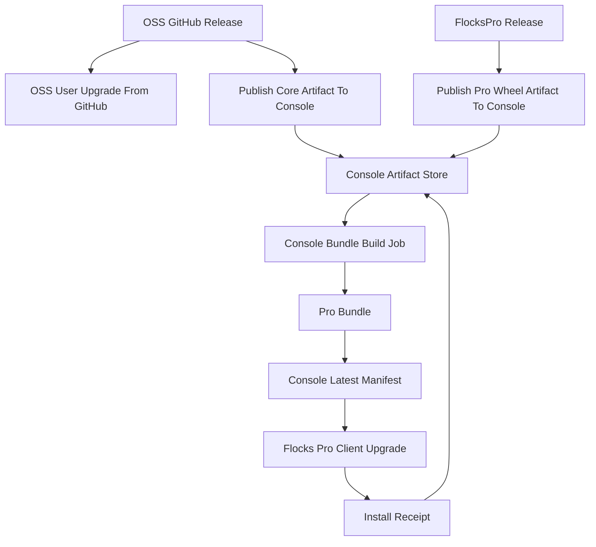

# Flocks Release And Upgrade Technical Design

## 目标

本文档描述当前已实现的 Flocks OSS、Flocks Pro、Flocks Console 三仓发布、构建、升级流程。

核心设计原则：

- OSS 版继续使用 GitHub Release 作为版本源。
- Pro 版客户端只信任 Console 下发的 Pro bundle manifest。
- Pro bundle 是 Console 侧组合发布物，由 OSS core artifact 和 latest Pro wheel artifact 合成。
- `flockspro` 私有仓只发布企业组件 wheel，不直接构建客户可升级的 bundle。
- 从 OSS 升级到 Pro 走 Console 审核、license 激活、Pro bundle 安装和安装回执闭环。

## 仓库职责

### `flocks`

`flocks` 仓负责 OSS 代码发布和客户端升级执行框架。

当前相关实现：

- GitHub Release 是 OSS 用户检查升级的版本源。
- `.github/workflows/trigger-pro-bundle.yml` 在 OSS release 发布后向 Console 上报 core artifact。
- `flocks/updater/updater.py` 负责版本检查、下载、校验、备份、替换、依赖同步、重启和回滚。
- `flocks/server/routes/cloud_upgrade.py` 负责 OSS 到 Pro 的升级申请、审核状态同步、license 激活、自动安装和安装回执上报。

### `flockspro`

`flockspro` 仓负责企业功能组件，不再负责 Pro bundle 构建。

当前相关实现：

- `.github/workflows/release-wheel.yml` 在 Pro release 或手动触发时构建 wheel。
- 构建完成后计算 wheel sha256，并向 Console 上报 Pro wheel artifact。
- `src/flockspro/updater/manifest.py` 定义 Pro bundle manifest 客户端合约。
- `src/flockspro/updater/source.py` 提供从 Console `/v1/manifest/latest` 读取 Pro bundle manifest 的 updater source。

### `flocks_console`

`flocks_console` 是 Pro 发布升级控制面。

当前相关实现：

- `src/flocks_console/app/manifest_service.py` 保存 core artifact、Pro wheel artifact、bundle build job、bundle release、安装回执。
- `src/flocks_console/app/pro_bundle_builder.py` 在 Console 侧合成 Pro bundle。
- `src/flocks_console/app/main.py` 提供 artifact 上报、build job、latest manifest、冻结、回滚、安装回执 API。
- `web/app/console/upgrade-requests/page.tsx` 和 `web/app/_components/upgrade-review-modal.tsx` 展示 latest core、latest Pro wheel、latest bundle、build job、安装回执。

## 总体流程



## 版本规则

### OSS 版本

OSS release tag 是 OSS 用户和 Pro bundle 的主版本来源，例如：

```text
v2026.5.18
```

OSS 用户看到的是：

```text
Flocks v2026.5.18
```

### Pro 组件版本

`flockspro` 私有包有独立组件版本，例如：

```text
pro-v2026-5-10
```

该版本只表示 Pro wheel 组件版本，不直接作为客户升级版本。

### Pro 对外版本

Pro 用户对外展示版本与 OSS release 保持一致，例如：

```text
Flocks Pro v2026.5.18
```

Console manifest 中：

```json
{
  "display_version": "v2026.5.18",
  "compare_version": "2026.5.18",
  "oss_version": "v2026.5.18",
  "flockspro_component_version": "pro-v2026-5-10"
}
```

`display_version` 用于 UI 展示，`compare_version` 用于客户端版本比较，`flockspro_component_version` 只作为详情和排障字段。

## OSS Release 与升级流程

### 发布流程

1. `flocks` 仓创建 GitHub Release，例如 `v2026.5.18`。
2. OSS 用户本地 updater 按原有 Release API 检查 GitHub/Gitee/GitLab sources。
3. `.github/workflows/trigger-pro-bundle.yml` 同时被 release published 触发。
4. workflow 下载 OSS release archive，计算 sha256。
5. workflow 向 Console 调用：

```http
POST /v1/ops/artifacts/flocks-core
```

请求字段：

```json
{
  "oss_version": "v2026.5.18",
  "archive_url": "https://github.com/AgentFlocks/flocks/archive/refs/tags/v2026.5.18.tar.gz",
  "archive_sha256": "...",
  "release_notes": "...",
  "source_repo": "AgentFlocks/flocks",
  "github_release_id": "...",
  "published_at": "2026-05-18T00:00:00Z"
}
```

### OSS 客户端升级

OSS 用户不依赖 Console。

客户端流程：

1. `check_update()` 调用 GitHub/Gitee/GitLab release source。
2. 获取 latest tag、release notes、archive URL。
3. 比较 latest tag 与当前版本。
4. 用户确认升级后调用 `perform_update()`。
5. 下载 archive。
6. 备份当前安装目录到 `~/.flocks/version/`。
7. 解压新版本源码。
8. 构建前端资源。
9. 替换安装目录。
10. 运行 `uv sync`。
11. 写入版本 marker。
12. 重启服务。
13. 失败时尽量从备份回滚。

## FlocksPro Release 与 Pro Wheel Artifact

### 发布流程

1. `flockspro` 仓创建 release，例如 `pro-v2026-5-10`。
2. `.github/workflows/release-wheel.yml` 被 release published 触发，或手动 workflow_dispatch 触发。
3. workflow 使用 `uv build --wheel --out-dir dist` 构建 wheel。
4. workflow 计算 wheel sha256。
5. workflow 拼出 wheel URL。
6. workflow 向 Console 调用：

```http
POST /v1/ops/artifacts/flockspro-wheel
```

请求字段：

```json
{
  "pro_version": "pro-v2026-5-10",
  "wheel_url": "https://cdn.agentflocks.com/flockspro/wheels/pro-v2026-5-10/flockspro-0.1.0-py3-none-any.whl",
  "wheel_name": "flockspro-0.1.0-py3-none-any.whl",
  "wheel_sha256": "...",
  "release_notes": "...",
  "source_repo": "AgentFlocks/flockspro",
  "github_release_id": "...",
  "published_at": "2026-05-10T00:00:00Z"
}
```

### 不触发 bundle

Pro wheel artifact 上报只更新 Console 中 latest Pro 组件，不自动创建客户可升级 bundle。

原因：

- Pro 组件独立迭代不应直接推动客户升级。
- 客户可升级版本以 OSS release 版本为主版本。
- 下一个 OSS release 会自动组合当前 latest Pro wheel。

## Console Artifact Store

Console 维护以下数据：

### `core_artifacts`

保存 OSS release artifact：

- `artifact_id`
- `oss_version`
- `archive_url`
- `archive_sha256`
- `release_notes`
- `source_repo`
- `github_release_id`
- `published_at`
- `is_latest`
- `metadata`

### `pro_wheel_artifacts`

保存 Pro wheel artifact：

- `artifact_id`
- `pro_version`
- `wheel_url`
- `wheel_name`
- `wheel_sha256`
- `release_notes`
- `source_repo`
- `github_release_id`
- `published_at`
- `is_latest`
- `metadata`

### `pro_bundle_build_jobs`

保存 bundle 构建任务：

- `job_id`
- `core_artifact_id`
- `pro_artifact_id`
- `release_id`
- `channel`
- `status`
- `reason`
- `error_message`
- `created_at`
- `updated_at`
- `metadata`

### `pro_bundle_releases`

保存已成功发布的 Pro bundle：

- `release_id`
- `channel`
- `display_version`
- `compare_version`
- `oss_version`
- `flockspro_component_version`
- `bundle_url`
- `bundle_sha256`
- `build_id`
- `release_notes`
- `published_at`
- `is_latest`
- `is_frozen`
- `metadata`

### `pro_bundle_installations`

保存客户端安装回执：

- `id`
- `release_id`
- `license_id`
- `passport_uid`
- `fingerprint`
- `install_id`
- `installed_version`
- `oss_version`
- `flockspro_component_version`
- `build_id`
- `install_result`
- `error_message`
- `reported_at`

## Console Bundle Build 流程

### 自动触发

当 Console 收到 core artifact 时：

1. 写入 `core_artifacts`，并设为 latest core。
2. 查找 latest Pro wheel artifact。
3. 如果存在 latest Pro wheel，创建 `pro_bundle_build_jobs`。
4. 当前实现会同步执行 build job。
5. 构建成功后写入 `pro_bundle_releases`，并设为 latest。
6. 如果不存在 latest Pro wheel，只保存 core artifact，不创建 bundle。

### 手动触发

Console 提供手动构建 API：

```http
POST /v1/ops/pro-bundles/builds
```

请求可指定：

```json
{
  "core_artifact_id": "core_...",
  "pro_artifact_id": "prowhl_...",
  "channel": "flockspro",
  "reason": "manual rebuild"
}
```

如果不指定 artifact id，则默认使用 latest core 和 latest Pro wheel。

### 构建内容

`src/flocks_console/app/pro_bundle_builder.py` 负责生成 bundle。

输入：

- core archive URL
- core archive sha256
- Pro wheel URL
- Pro wheel sha256
- OSS version
- Pro component version
- channel
- build id
- release notes

构建步骤：

1. 下载或复制 core archive。
2. 校验 core archive sha256。
3. 下载或复制 Pro wheel。
4. 校验 Pro wheel sha256。
5. 解压 core archive。
6. 将 core 源码放入 bundle 的 `flocks/`。
7. 将 Pro wheel 放入 bundle 的 `wheels/`。
8. 生成 bundle 内部 `manifest.json`。
9. 生成 `checksums.txt`。
10. 打包为 `flockspro-bundle-vYYYY.M.D.tar.gz`。
11. 计算 bundle sha256。
12. 写入本地 dev storage 或对象存储对应目录。

Bundle 结构：

```text
flockspro-bundle-v2026.5.18.tar.gz
├── flocks/
├── wheels/
│   └── flockspro-*.whl
├── manifest.json
└── checksums.txt
```

内部 `manifest.json`：

```json
{
  "schema_version": 1,
  "display_version": "v2026.5.18",
  "compare_version": "2026.5.18",
  "channel": "flockspro",
  "edition": "flockspro",
  "oss_version": "v2026.5.18",
  "flockspro_component_version": "pro-v2026-5-10",
  "flockspro_wheel": "wheels/flockspro-0.1.0-py3-none-any.whl",
  "build_id": "job_...",
  "published_at": "2026-05-18T00:00:00Z",
  "requires_license_status": ["trial", "test", "commercial"],
  "release_notes": "..."
}
```

如果配置了 `FLOCKSPRO_MANIFEST_SIGNING_SECRET`，内部 manifest 会附加 `manifest_signature`。

## Console Manifest 下发

Pro 客户端检查升级时访问：

```http
GET /v1/manifest/latest?channel=flockspro
```

Console 会：

1. 校验 cloud session。
2. 读取 `pro_bundle_releases` 中 latest release。
3. 如果 release 已 frozen，则拒绝下发。
4. 返回 bundle manifest。
5. 如果配置了 `FLOCKSPRO_MANIFEST_SIGNING_SECRET`，返回 manifest_signature。

返回示例：

```json
{
  "schema_version": 1,
  "edition": "flockspro",
  "display_version": "v2026.5.18",
  "compare_version": "2026.5.18",
  "channel": "flockspro",
  "bundle_url": "https://cdn.agentflocks.com/flockspro/v2026.5.18/flockspro-bundle-v2026.5.18.tar.gz",
  "bundle_sha256": "...",
  "oss_version": "v2026.5.18",
  "flockspro_component_version": "pro-v2026-5-10",
  "build_id": "job_...",
  "published_at": "2026-05-18T00:00:00Z",
  "requires_license_status": ["trial", "test", "commercial"],
  "release_notes": "..."
}
```

## Pro 客户端升级流程

### Source 锁定

`flocks/updater/updater.py` 中 `_resolve_sources_for_edition()` 会检测：

- `FLOCKS_EDITION=flockspro`
- 或本地存在 cloud session

只要进入 Pro edition，升级源强制为：

```python
["cloud-manifest"]
```

Pro 用户不会回退到 GitHub/Gitee/GitLab OSS source。

### 检查更新

Pro 客户端调用 `_fetch_cloud_manifest_release()`：

1. 读取 `FLOCKS_MANIFEST_BASE_URL`。
2. 默认 channel 为 `flockspro`。
3. 携带 cloud session token 调用 Console `/v1/manifest/latest`。
4. 检查 `frozen` 和 `frozen_until`。
5. 读取 `compare_version` 作为比较版本。
6. 读取 `bundle_url` 作为下载 URL。
7. 缓存 manifest，用于后续 bundle sha256 校验。

### 执行升级

`perform_update()` 对 Pro bundle 执行以下步骤：

1. 下载 bundle。
2. 使用 manifest 中的 `bundle_sha256` 校验下载文件。
3. 备份当前安装目录。
4. 解压 bundle。
5. 识别 bundle 结构：
   - 如果存在 `manifest.json` 和 `flocks/`，认为是 Pro bundle。
   - 使用 `flocks/` 作为 OSS 源码根目录。
   - 从 `manifest.json` 的 `flockspro_wheel` 或 `wheels/*.whl` 找到 Pro wheel。
6. 预构建前端。
7. 替换安装目录。
8. 运行 `uv sync`。
9. 使用 `uv pip install --python .venv/bin/python wheels/flockspro-*.whl` 安装 Pro wheel。
10. 写入 `~/.flocks/run/pro-bundle-installed.json`，记录：
    - `installed_version`
    - `oss_version`
    - `flockspro_component_version`
    - `build_id`
    - `installed_at`
11. 写入当前版本 marker。
12. 刷新 CLI entry。
13. 重启服务或在自动安装场景下跳过 restart。
14. 失败时从备份回滚。

## 从 OSS 升级到 Pro 的流程

OSS 到 Pro 是一次 edition switch，不是普通 OSS release 升级。

### 申请阶段

1. OSS 用户在本地发起 Pro 升级申请。
2. `flocks/server/routes/cloud_upgrade.py` 创建本地升级申请记录。
3. 客户端要求已有 cloud binding session。
4. OSS 节点向 Console 创建 upgrade request。
5. Console 审核台展示申请信息、latest core、latest Pro wheel、latest bundle、build job、安装回执。

### 审核阶段

1. Console 运维审核申请。
2. 审核通过后生成 activate key。
3. 审核记录绑定当前 latest Pro bundle 的 `manifest_url`。
4. OSS 客户端刷新申请状态。

### 激活与安装阶段

当 OSS 客户端发现申请状态为 `approved`：

1. `_maybe_activate_pro_license()` 调用 Pro license checker 激活 license。
2. `_maybe_refresh_pro_license()` 刷新 cloud license 状态。
3. `_run_auto_upgrade_install()` 调用 `check_update()`。
4. 由于已进入 Pro 流程，升级源为 Console cloud manifest。
5. 下载并安装 latest Pro bundle。
6. 安装成功后本地状态变为 `activated`。

### 回执阶段

安装完成后：

1. 客户端读取 `~/.flocks/run/pro-bundle-installed.json`。
2. 调用 Console：

```http
POST /v1/pro-bundles/installations
```

请求字段：

```json
{
  "license_id": "act_...",
  "fingerprint": "...",
  "install_id": "...",
  "installed_version": "v2026.5.18",
  "oss_version": "v2026.5.18",
  "flockspro_component_version": "pro-v2026-5-10",
  "build_id": "job_...",
  "install_result": "success",
  "reported_at": "2026-05-18T00:00:00Z"
}
```

失败时 `install_result` 为 `failed`，并附带 `error_message`。

## 运维 API

### Artifact API

```http
POST /v1/ops/artifacts/flocks-core
GET /v1/ops/artifacts/flocks-core
POST /v1/ops/artifacts/flockspro-wheel
GET /v1/ops/artifacts/flockspro-wheel
```

### Bundle Build API

```http
POST /v1/ops/pro-bundles/builds
GET /v1/ops/pro-bundles/builds
```

### Bundle Release API

```http
POST /v1/ops/pro-bundles/publish
GET /v1/ops/pro-bundles
POST /v1/ops/pro-bundles/{release_id}/freeze
POST /v1/ops/pro-bundles/{release_id}/promote
```

`publish` 当前保留为内部发布步骤或兼容运维入口。正常流程中，成功的 Console build job 会自动写入 `pro_bundle_releases`。

### Installation API

```http
POST /v1/pro-bundles/installations
GET /v1/ops/pro-bundles/installations
```

## 冻结与回滚

### 冻结

如果某个 Pro bundle 有问题，运维可调用：

```http
POST /v1/ops/pro-bundles/{release_id}/freeze
```

冻结后 latest manifest 不再向客户端下发该 release。

### 回滚

如果需要回滚到旧 bundle，运维可调用：

```http
POST /v1/ops/pro-bundles/{release_id}/promote
```

该 release 会成为 latest，并解除 frozen 状态。

## 配置项

### GitHub Actions Secrets

`flocks` 仓：

- `FLOCKS_CONSOLE_API_BASE`
- `FLOCKS_CONSOLE_OPS_TOKEN`

`flockspro` 仓：

- `FLOCKS_CONSOLE_API_BASE`
- `FLOCKS_CONSOLE_OPS_TOKEN`
- `FLOCKSPRO_WHEEL_BASE_URL`

### Console 环境变量

- `FLOCKS_CONSOLE_OPS_TOKEN`：保护 ops API。
- `FLOCKSPRO_MANIFEST_SIGNING_SECRET`：签名 manifest。
- `FLOCKS_CONSOLE_BUNDLE_DIR`：本地 bundle 存储目录，默认 `~/.flocks/console/bundles`。
- `FLOCKS_CONSOLE_BUNDLE_BASE_URL`：bundle 对外访问 base URL，默认 `https://cdn.agentflocks.com/flockspro`。

### Pro 客户端环境变量

- `FLOCKS_EDITION=flockspro`：强制进入 Pro edition。
- `FLOCKS_MANIFEST_BASE_URL`：Console manifest base URL。
- `FLOCKS_UPDATE_CHANNEL=flockspro`：Pro bundle channel。

## 当前实现边界

当前实现已经完成主链路：

- OSS release 上报 core artifact。
- Pro release 上报 wheel artifact。
- Console 保存 artifact。
- Console 根据 latest core + latest Pro wheel 构建 bundle。
- Console 下发 latest manifest。
- Pro 客户端下载 bundle、校验 sha256、安装 OSS core 和 Pro wheel。
- OSS 到 Pro 通过审核、license 激活、bundle 安装、安装回执闭环。

仍需部署侧保证：

- workflow 中上报的 `archive_url`、`wheel_url` 必须能被 Console builder 下载。
- 如果使用对象存储/CDN，需要由 CI 或发布平台先上传 artifact，再上报 Console。
- 当前 Console builder 在 API 进程内同步执行，生产环境建议迁移为后台 worker/job runner。
- `FLOCKS_CONSOLE_BUNDLE_BASE_URL` 需要指向真实可下载的 bundle 对外地址。

## 测试覆盖

当前相关测试：

- `flockspro/tests/test_manifest_contract.py`：Pro manifest 合约解析与签名。
- `flocks/tests/updater/test_updater_cloud_manifest_bundle.py`：Pro cloud manifest bundle URL、冻结逻辑。
- `flocks/tests/updater/test_updater_edition_sources.py`：Pro edition 强制 cloud manifest。
- `flocks/tests/server/routes/test_cloud_upgrade_routes.py`：OSS 到 Pro 升级申请、自动激活、安装触发。
- `flocks_console/tests/test_api.py`：artifact 上报、bundle build、latest manifest、安装回执。
- `flocks_console/tests/test_schema_migrations.py`：schema 表结构覆盖。

